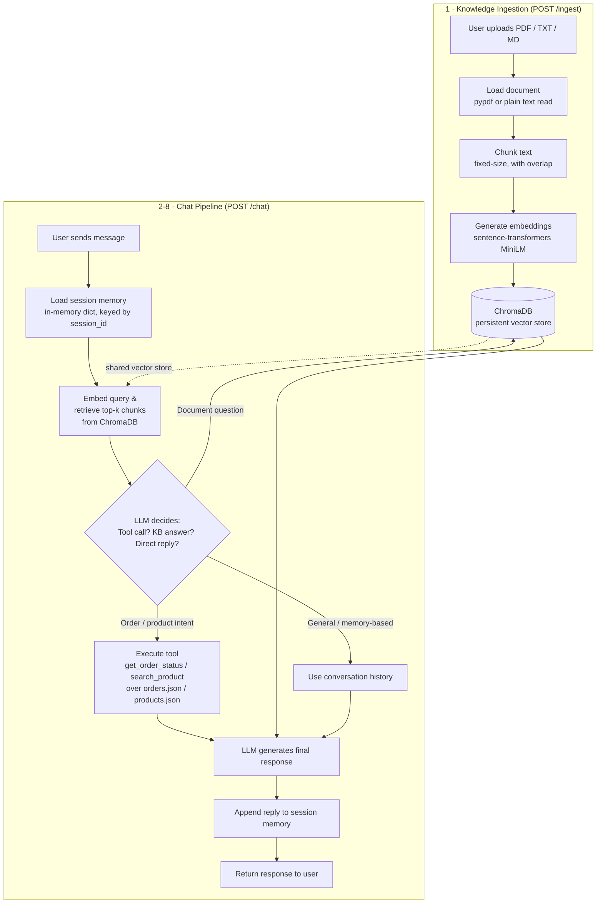

# Architecture / Pipeline Diagram

This renders natively on GitHub (Mermaid support built in).



## Text description (fallback if Mermaid doesn't render)

```
[Ingestion]
  Upload (PDF/TXT/MD)
      -> Load document (pypdf / plain text)
      -> Chunk (fixed-size, overlap)
      -> Embed (MiniLM, local)
      -> Store (ChromaDB, persisted to disk)

[Chat]
  User message
      -> Load session memory (in-memory dict)
      -> Embed query -> retrieve top-k chunks from ChromaDB
      -> LLM call with: system prompt + retrieved context + tool schemas
                        + conversation history
      -> LLM decides:
           - Tool needed (order/product)? -> call get_order_status /
             search_product -> feed result back to LLM -> final reply
           - Document question, answer in context?  -> answer from context
           - Document question, NOT in context?      -> fixed fallback message
           - General/memory-based (name recall, "cheaper options", etc.)
             -> answered from conversation history directly
      -> Append user + assistant turns to session memory
      -> Return reply (+ used_tool, used_retrieval, sources) to user
```
