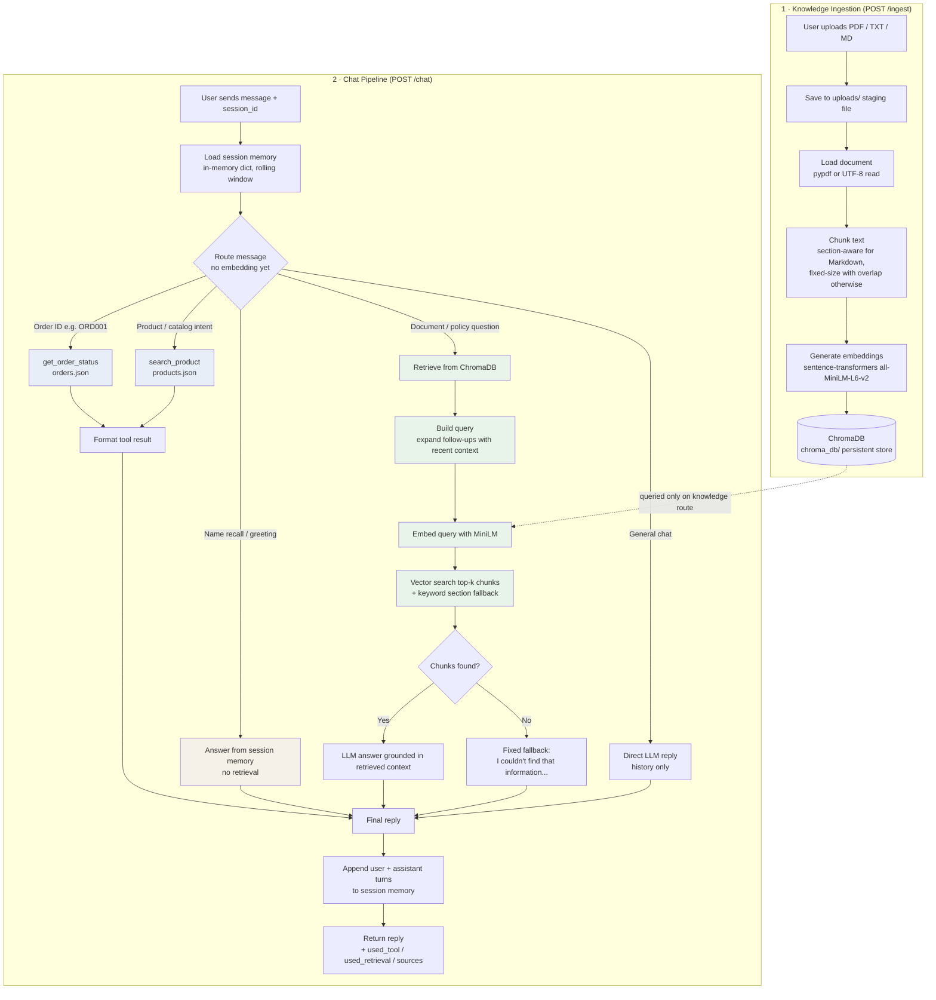

# Architecture / Pipeline Diagram

Architecture for the AI-Assistant.



## Key design points

| Path | Embedding / ChromaDB? | Data source |
|------|----------------------|-------------|
| Document questions (RAG) | **Yes** — query embedded, vector search in ChromaDB | Uploaded documents |
| Order status | **No** | `data/orders.json` |
| Product search | **No** | `data/products.json` (independent of uploaded docs) |
| Name recall / greeting | **No** | Session memory only |
| Direct chat | **No** | LLM + session memory |

**`uploads/`** — temporary copy of the file at ingest time; not searched at chat time.

**`chroma_db/`** — the vector database searched during the knowledge route only.

## Text description (fallback if Mermaid doesn't render)

```
[Ingestion — POST /ingest]
  User uploads PDF / TXT / MD
      -> Save to uploads/ (staging)
      -> Load document (pypdf / plain text)
      -> Chunk (Markdown: split on ## sections; else fixed-size with overlap)
      -> Embed chunks (all-MiniLM-L6-v2, local)
      -> Store vectors + text + metadata in ChromaDB (chroma_db/)

[Chat — POST /chat]
  User message + session_id
      -> Load session memory (in-memory dict, capped turns)
      -> ROUTE the message (no embedding for most paths):
           |
           |-- Order ID detected?
           |       -> get_order_status(orders.json) -> format reply
           |
           |-- Product / catalog intent?
           |       -> search_product(products.json) -> format reply
           |       (catalog is separate from uploaded documents)
           |
           |-- Name recall / greeting?
           |       -> answer from session memory only
           |
           |-- Document / policy / follow-up question?
           |       -> Build retrieval query (expand short follow-ups with context)
           |       -> Embed query -> vector search ChromaDB (top-k, threshold)
           |       -> Keyword/section fallback if needed
           |       -> LLM generates answer from retrieved chunks
           |       -> If nothing relevant: fixed "I couldn't find..." message
           |
           '-- Otherwise
                   -> Direct LLM reply using conversation history
      -> Append user + assistant turns to session memory
      -> Return reply (+ used_tool, used_retrieval, sources)
```

## Component map

| Module | Responsibility |
|--------|----------------|
| `app/main.py` | FastAPI endpoints, orchestrates ingest + chat |
| `app/ingestion.py` | Load → chunk → embed → ChromaDB |
| `app/retrieval.py` | Embed query, vector search, keyword fallback (knowledge route only) |
| `app/llm.py` | Route message, call tools / retrieval / memory / LLM |
| `app/memory.py` | Per-session conversation history |
| `app/tools.py` | Mock order + product lookups from JSON files |
